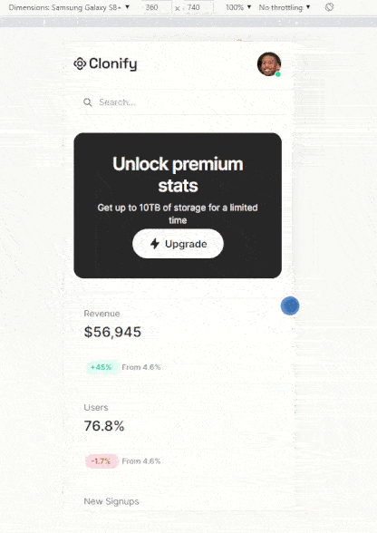

# Clonify Dashboard
Responsive static web page implemented based on a [Figma design](https://www.figma.com/file/bpj8Qfl3IJ0oaIKVw0OsPn/Untitled?type=design&node-id=0%3A1&mode=design&t=Kl5KlPxuUkm8SK3w-1).
The web page is implemented with pure HTML and CSS.

## Local deployment
- Clone repository;
- Open `clonify-dashboard` directory;
- Open index.html

## Demo

 

